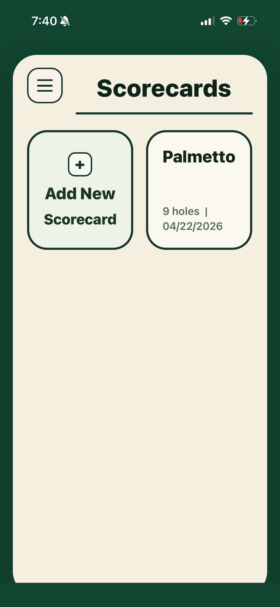
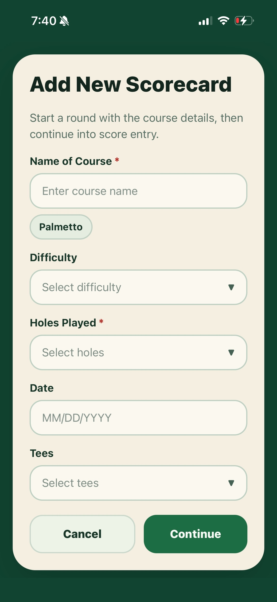
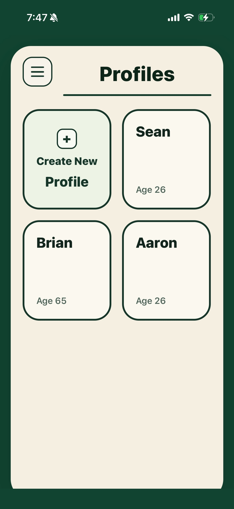
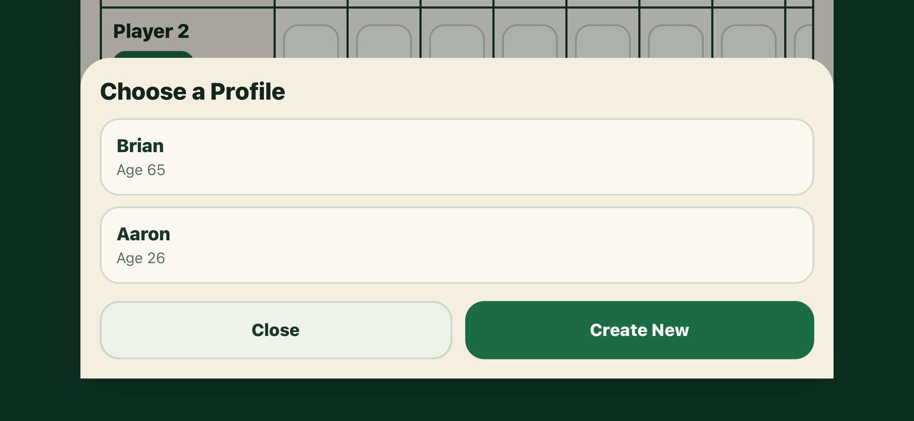
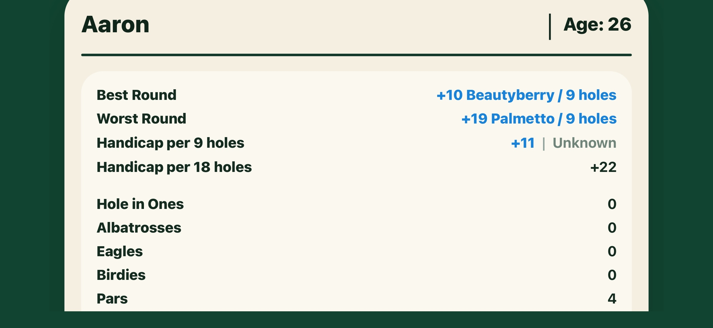
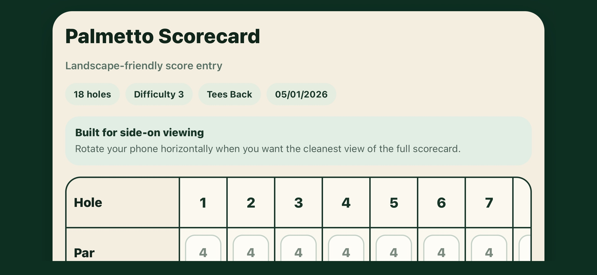
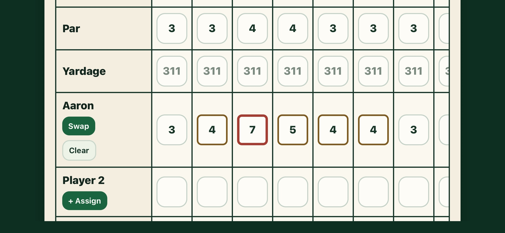

# Golf Scoring Mobile App

Golf Scoring is an Expo React Native app for tracking golf rounds, player profiles, scorecards, and course history from a phone.

The app is designed for quick round entry on iPhone, including landscape scorecard entry when a wider view is needed.

## Features

- Create 9-hole or 18-hole scorecards.
- Track course name, date, difficulty, tees, par, yardage, and player strokes.
- Assign reusable player profiles to scorecards.
- Prevent duplicate profile names.
- Edit player profile name and date of birth after creation.
- Automatically calculate scorecard totals for par and player strokes.
- Mark scoring results visually, including red square markers for triple bogey or worse.
- Track player stats such as best round, worst round, handicap per 9 holes, handicap per 18 holes, and scoring tallies.
- Remember previously played courses.
- Suggest course names when creating a new scorecard.
- Autofill par and yardage from a previous scorecard for the same course and hole count.
- Save profiles and scorecards locally so data remains after closing and reopening the app.

## Screenshots

| Home | Create Scorecard | Profiles |
| --- | --- | --- |
|  |  |  |

| Choose or Create Profile | Profile Stats |
| --- | --- |
|  |  |

| Landscape Scorecard Top | Landscape Scorecard Bottom |
| --- | --- |
|  |  |

## Local Development

Install dependencies:

```bash
npm install
```

Start Expo:

```bash
npx expo start
```

Run the web preview:

```bash
npm run web
```

Run TypeScript checks:

```bash
npm run typecheck
```

## iPhone Testing

The quickest testing path is Expo Go.

1. Pull the latest code on the MacBook.
2. Run `npm install`.
3. Run `npx expo start`.
4. Install Expo Go on the iPhone.
5. Scan the QR code from the Expo terminal.

If the phone cannot connect over the local network, use:

```bash
npx expo start --tunnel
```

## Data Storage

The app stores scorecards and profiles locally with AsyncStorage. This keeps data available after closing and reopening the app on the same device.

This is local persistence only. It does not sync data between devices yet.
